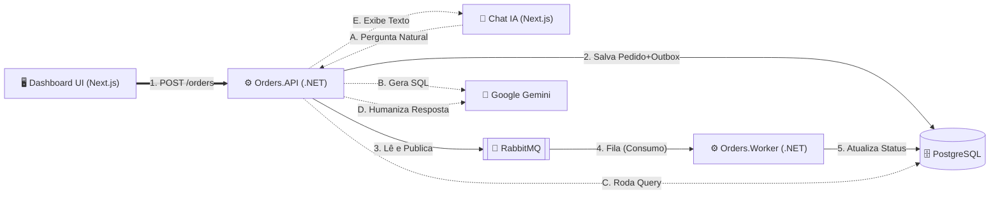

# 📦 Sistema de Gestão de Pedidos (Outbox Pattern & IA)

Olá! 👋 Bem-vindo ao repositório do meu desafio técnico. 

Desenvolvi este projeto focando em entregar um código resiliente, com arquitetura limpa e direcionado a resolver os problemas propostos no desafio, sem criar complexidades desnecessárias. Abaixo, detalho como rodar o projeto localmente e compartilho o racional por trás de cada decisão técnica que tomei durante a construção.

## 🚀 Como Executar o Projeto (Focando na DX)

Como premissa de excelente Experiência de Desenvolvimento (DX) aliada à Segurança, o projeto foi 100% "dockerizado" e utiliza arquivos `.env` para proteger segredos.

Na raiz do projeto, siga estes passos:

1. Faça uma cópia do arquivo de configuração:
```bash
cp .env.example .env
```
*(Abra o arquivo `.env` recém-criado e cole a sua chave do Google Gemini na variável `GEMINI_API_KEY`, se quiser testar o chat. As senhas de banco e pgAdmin já vêm preenchidas por padrão para uso local).*

2. Suba o ambiente:
```bash
docker-compose up -d --build
```

**O que esse comando faz?**
1. Sobe o **PostgreSQL** e o **RabbitMQ** aguardando os healthchecks.
2. Compila e sobe a **API (.NET 8)** na porta `5000` (rodando as *migrations* do banco automaticamente).
3. Compila e sobe o **Worker (.NET 8)** em background para ler as filas.
4. Compila e sobe o **Frontend (Next.js)** na porta `3000`.

### 🔗 Links de Acesso Úteis
- **Frontend (Painel Principal):** [http://localhost:3000](http://localhost:3000)
- **Painel de Mensageria (RabbitMQ):** [http://localhost:15672](http://localhost:15672) *(User: `guest` | Pass: `guest`)*
- **Painel de Telemetria (Aspire Dashboard):** [http://localhost:18888](http://localhost:18888) *(Tracing e logs dos containers)*
- **Painel do Banco de Dados (pgAdmin):** [http://localhost:5050](http://localhost:5050)
  - **Login:** *(Veja as variáveis `PGADMIN_EMAIL` e `PGADMIN_PASS` no seu arquivo `.env`)*
  - *Dica para conectar o banco:* Dentro do painel, clique em *Add New Server*. Na aba 'Connection', preencha Hostname: `postgres`, Port: `5432`, e as credenciais definidas em `DB_USER` e `DB_PASS` no seu arquivo `.env`.

### 🧪 Como rodar a Suíte de Testes
Este projeto possui Testes de Integração avançados usando **Testcontainers** (bancos reais efêmeros no Docker). Em um terminal na raiz, rode:
```bash
cd backend
dotnet test
```

---

## 📐 Arquitetura do Sistema

Para facilitar a visualização de como os componentes se comunicam, desenhei este diagrama da nossa topologia:



---

## 🧠 Por que tomei essas decisões técnicas?

Eu gosto de justificar minhas escolhas arquiteturais fugindo um pouco do "hype" da tecnologia e focando no que realmente resolve o problema de negócio de forma escalável e dentro do prazo estipulado.

### 1. O Problema do "Dual-Write" e a escolha do RabbitMQ
Eu precisava salvar o pedido no banco de dados e avisar os outros sistemas via mensageria. Como garantir que a rede não falhe no milissegundo exato entre salvar no banco e enviar para a fila? 
Eu decidi usar o **Outbox Pattern**. Eu salvo o Pedido e a Mensagem de evento na mesma *transação ACID* do Entity Framework no PostgreSQL. Depois, um `BackgroundService` da própria API lê a tabela de tempos em tempos e publica na fila. 

### 2. O Worker e a Idempotência
Trabalhar com sistemas distribuídos é assumir como verdade absoluta que a rede vai falhar ou duplicar mensagens. Para blindar o sistema, fiz o meu serviço `Orders.Worker` ser extremamente defensivo. Sempre que ele pega uma mensagem, ele vai ao banco de dados e confere o status real. Se não estiver mais como `Pendente`, ele encerra o processo (Idempotência). Amarrei a regra no código para garantir matematicamente o ciclo estrito: *Pendente → Processando → Finalizado*.

### 3. Tempo Real no Frontend (De forma Pragmática)
O desafio pedia atualização de status em tempo real com fallback. Eu poderia ter plugado um servidor SignalR (WebSockets), mas pesando o custo x benefício e o tempo do desafio, optei por uma solução muito mais enxuta: **TanStack React Query** no Next.js com um `refetchInterval` de 3 segundos (*Short Polling*). Funciona de forma fluida, cobre a exigência nativamente e economiza infraestrutura de conexões abertas no servidor. 

### 4. Inteligência Artificial e o The Twelve-Factor App
O Módulo de IA tem foco na arquitetura corporativa: apliquei o *Dependency Inversion Principle* (SOLID) e criei uma interface genérica (`IAiAnalyticsService`). A API não sabe qual LLM está respondendo. Se no futuro for preciso assinar e usar o GPT-4 da OpenAI, basta plugar a classe correspondente e injetar o serviço no `Program.cs`, sem encostar em regra de negócio ou ferir os doze fatores da aplicação.

### 5. A morte aos "Mocks" (Testes de Integração reais)
Testar consultas de banco e filas simulando eles na memória causa falsos positivos. Para testar a infraestrutura de fato, utilizei o **Testcontainers**. A cada execução dos meus testes, ele sobe um container efêmero no Docker, testa a API salvando no PostgreSQL real com RabbitMQ real, e destrói o ambiente depois. Também apliquei o padrão de **Golden Tests** (Snapshot usando `Verify.Xunit`) travando os contratos da API.

---
Muito obrigado pela oportunidade! Fico à disposição para debatermos e aprofundarmos qualquer uma dessas decisões técnicas na entrevista!
